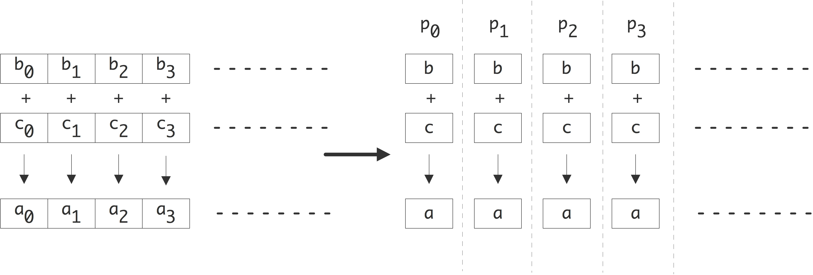
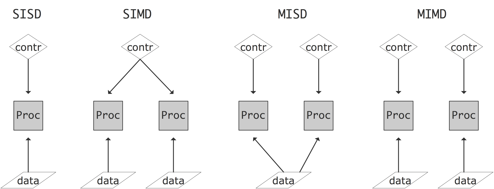
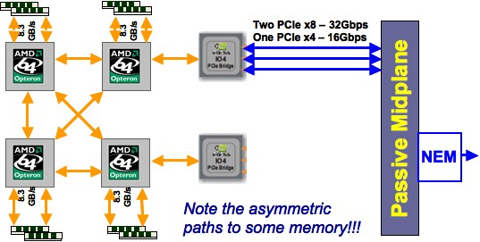

# 并行计算

规模最大且运算能力最强的计算机通常被称为 "超级计算机"。在过去的二十年里，超级计算机的概念无一例外地指向拥有多个CPU且可同时处理一个问题的机器——并行计算机。

我们很难精确定义并行的概念，因为它在不同的层面上有着不同的含义。在上一章中，同一个CPU内部可以有若干条指令同时“执行”，这是所谓的「**指令级并行**」（instruction-level parallelism，ILP）。指令级并行并不在用户的控制范围内，而是由编译器和CPU共同决定。另一种并行的概念为多个处理器同时处理一条以上的指令，每个处理器都在自己所在的电路板上，这种并行可以由用户显式地调度。

这一章中，我们将分析这种更明确的并行类型，支持它的硬件，使其成为可能的编程，以及分析它的概念。

## 引言

在科学计算中，我们常常需要处理大量且有规律的操作。有没有一种并行计算机可以加快这项工作？假设我们需要执行$n$步操作，且每一步操作在单处理器上需要花费的时间为$t$，那么使用$p$个处理器，我们能否在$t/p$的时间内完成这些工作？

让我们先从一个简单的例子开始。假设需要将两个长度为$n$的向量相加：

```c
for (i=0; i<n; i++)
  a[i] = b[i] + c[i];
```

最多可以用$n$个处理器来完成。下图所示中，每个处理器都存储一个a,b,c，且各自执行单一指令：a=b+c。



一般情况下，每个处理器执行的指令类似于

```c
for (i=my_low; i<my_high; i++)
  a[i] = b[i] + c[i];
```

程序执行的时间随着处理器数量的增加而线性减少。若定义每步操作为单位时间，原始算法耗时$n$，而在$p$个处理器上的并行执行需要的时间为$n/p$，并行后的速度是原来的$p$倍。

>  输入一个向量而得到一个标量的操作通常称为**规约**（reduction）

下面我们考虑对向量内各元素求和，假设每个处理器只包含一个数组中的元素，顺序执行：

```c
s = 0;
for (i=0; i<n; i++)
  s += x[i]
```

这段代码的并行情况并不明显，但如果我们将循环改写成：

```c
for (s=2; s<2*n; s*=2)
     for (i=0; i<n-s/2; i+=s)
       x[i] += x[i+s/2]
```

则可以找到相应的方法将其并行化：外循环的每一次迭代现在都是一个可以由$n/s$处理器并行完成的循环。由于外循环将经过 $log_2n$次迭代，我们可以看到新算法的运行时间缩短为$n/p⋅log_2n$。并行算法的速度比原来快了 $p/log_2n$倍。


从这两个简单的例子中可以看到并行计算的一些特点：

- 算法被稍加改写后可以成为并行算法。

- 并行算法并不一定能达到理想加速效果。

此外，第一种情况下每个处理器的$x_i, y_i$都在本地存储，这不会造成额外的时间开销；但在第二种情况下，处理器之间需要进行数据通信，这又会造成大量的开销。

下面我们讨论通信。我们可以把上图右半部分的并行算法变成一个树状图，把输入定义为树的节点，将所有的加和操作视为内部节点，总和作为根节点。如果一个节点是另一个节点的（部分）和的输入，则有一条从一个节点到另一个节点的边。在这个树状图中，可同时计算的元素放置在同一层级；每一级有时被称为「**超步计算**」（superstep）。垂直排列的节点意味着计算是在同一处理器上完成的，从一个处理器到另一个处理器的箭头对应着一次通信。树状图中的排列顺序并非唯一。如果节点在一个超步或水平层级上重新排列，就会出现不同的通信模式。


**练习 2.1** 考虑将超步内的节点放在随机处理器上。表明如果没有两个节点出现在同一个处理器上，那么最多只能进行两倍于图中的通信数量。

**练习 2.2** 你能画出在每个处理器上留下总和结果的计算图吗？有一种解决方案需要两倍的超步，也有一种解决方案需要相同的数量。在这两种情况下，图不再是一棵树，而是一个更普遍的「**有向无环图**」（Directed Acyclic Graph，DAG）。

处理器之间通常通过网络连接，由于网络之间传输数据需要时间，我们引入处理器之间距离的概念。在上文树状图中，处理器的排列是线性的，这与它们在排序中的等级有关。如果网络只连接一个处理器和它的邻节点，外循环的每一次迭代都会增加通信的距离。

**练习 2.3** 假设一个加法操作需要一个单位时间，而把一个数字从一个处理器移到另一个处理器也需要同样的单位时间。证明通信时间等于计算时间。

现在假设从处理器$p$发送一个数字到$p \pm k$需要时间$k$。说明现在并行算法的执行时间与顺序时间是一样的。求和的例子做了一个不现实的假设，即每个处理器最初只存储一个向量元素：实际上我们会有$p < n$，每个处理器都会存储一些向量元素。明显的策略是给每个处理器一个连续的元素序列，但有时明显的策略并不是最好的。

**练习 2.4** 考虑用4个处理器对8个元素求和的情况。表明图2.3中的一些边不再对应于实际通信。现在考虑用4个处理器对16个元素进行求和。这次通信边的数量是多少？

这些关于算法适应性、效率和通信的问题，对所有的并行计算都是至关重要的。在本章中，我们将以各种形式回到这些问题上。

### 功能性并行与数据级并行

从上面的介绍中，我们可以将并行概念定义为：在程序的执行过程中寻找独立的操作。这些独立的操作往往其执行逻辑相同，只是用于不同的数据项。我们把这种情况称为「**数据级并行**」（data parallelism）：同一操作被并行地应用于许多数据元素，这在科学计算中是十分常见的。并行性往往源于这样一个事实：一个数据集（向量、矩阵、图......）被分散到许多处理器上，每个处理器都在处理其数据的一部分。

如果是单指令操作，传统上多采用数据级并行；如果是在子程序下处理，则通常称为「**任务并行**」（task parallelism）。

我们一定可以找到这样一种场景，使得指令之间相互独立且无依赖关系。一般情况下，编译器根据指令级并行来分析、运行代码：一条独立的指令可以被赋予给一个独立的浮点单元，也可以在优化寄存器时被重新排列。（同样参考2.5.2节）。

指令级并行是功能性并行的一种情况；功能并行可以通过连接相互独立的子程序来获得。在更高层次上，功能并行可以通过包含独立的子程序来获得，通常称为任务并行；见2.5.3节。

功能性并行的一些例子是蒙特卡洛模拟，以及其他穿越参数化搜索空间的算法。一个参数化的搜索空间，如布尔可满足性问题。

### 算法中的并行性与代码中的并行性

有时程序可以直接并行化处理，例如上文讨论的向量加法；有时我们很难找到简易的并行策略，例如在6.10.2节中将要讨论线性递归；而有些情况下，代码看起来可能没办法并行，但我们可以从理论上进行并行化处理。

**练习 2.5** 回答下列有关双循环$i,j$的问题。

```c
for i in [1:N]:
              x[0,i] = some_function_of(i)
              x[i,0] = some_function_of(i)
```

```c
for i in [1:N]:
              for j in [1:N]:
                  x[i,j] = x[i-1,j]+x[i,j-1]
```

1. 内循环的迭代是否独立，也就是说，它们是否可以同时执行？
2. 外循环的迭代是否独立？
3. 如果$x[1,1]$是已知的，说明$x[2,1]$和$x[1,2]$可以独立计算。
4. 这是否让你对并行化策略有了一个想法？

我们将在第6.10.1节讨论这个难题的解决方案。总的来说，第6章的全部内容都将是关于科学计算算法中内在的并行性数量。

## 理论概念

使用并行计算机有两个重要原因：获得更多的内存或者获得更高的性能。用更多的内存的原因很容易解释，因为总内存是各个内存的总和；而并行计算机的速度则较难描述。本节将对采用并行架构后的措施和理论速度进行拓展讨论。

### 定义

#### 加速比和效率

对比同一个程序在单处理器上运行的时间与$p$个处理器上的运行时间可以得到加速比，设$T_1$是在单个处理器上的执行时间，$T_p$是在$p$个处理器上的运行时间，则加速比为$S_p=T_1/T_p$(有时$T_1$被定义为 "在单个处理器上解决问题的最短时间"，这允许在单个处理器上使用不同于并行的算法)。 在理想情况下，$T_p=T_1/p$，但在实际中往往难以达到，因此$S_p\leqslant p$。为了衡量我们离理想的加速有多远，我们引入了效率$E_p = S_p/p$。显然，$0<E_p≤1$。

上面的定义会产生一个问题：某个需要并行解决的问题由于规模太大，无法在任何一个单独的处理器上运行；反之，将单处理器上的问题拆解在多处理器上，由于每个处理器上的数据非常少，因此可能会得到一个十分扭曲的结果。下面我们将讨论更现实的速度提升措施。

有各种原因导致实际速度低于𝑝。首先，使用多个处理器意味着额外的通信开销；其次，如果处理器并未分配到完全相同的工作量，则会产生一部分的闲置，就会造成「**负载不均衡**」（load unbalance），再次降低实际速度；最后，代码运行可能依赖其原有顺序。

处理器之间的通信是效率损失的一个重要来源。显然，一个不用通信就能解决的问题是非常有效的。这类问题实际上由许多完全独立的计算组成被称为「**高度并行**」（embarrassingly parallel），它们拥有接近完美的加速比和效率。

**练习 2.6** 加速比大于处理器数量被称为「**超线性加速**」（superlinear speedup）。请给出一个理论上的论据，为什么这种情况不会发生。

在实践中，超线性加速可能发生。例如，假设一个问题太大，无法装入内存，一个处理器只能通过交换数据到磁盘来解决。如果同一个问题适合在两个处理器的内存中解决，那么速度的提升很可能大于2，因为磁盘交换不再发生。拥有更少或更局部的数据也可以改善代码的缓存行为。

#### 代价最优

在达不到理想加速比的情况下，我们可以将理想加速比与实际加速之间的差异定义为「**额外开销**」（overhead）：
$$
T_0 =  pT_p - T1
$$
我们也可以把它解释为在单个处理器上模拟并行算法，与实际的最佳串行算法之间的差异。

我们以后会看到两种不同类型的开销。

1.  并行算法可以与串行算法有本质上的不同。例如，排序算法的复杂度为$O(nlogn)$，但并行双调排序（8.6 节）的复杂度为$O(nlog^2n)$。

2.  并行算法可以有来自于过程或并行化的开销，比如发送消息的成本。我们在6.2.2节中分析了矩阵与向量乘积中的通信开销。

如果一个并行算法与串行算法达到了数量级差距，那么该算法就被称为「**代价最优**」（cost-optimal）。

**练习 2.7** 上面的额外开销定义隐含地假定开销是不可并行的。在上述两个例子的背景下讨论这个假设。

### 渐近论

如果我们忽略一些限制，比如处理器的数量，或者它们之间的互连的物理特性，我们可以就推导出关于并行计算效率极限的理论结果。本节将简要介绍这些结果，并讨论它们与现实中高性能计算的联系。

例如，考虑矩阵与矩阵乘法$𝐶=𝐴𝐵$，它需要$2𝑁$步操作，其中$𝑁$是矩阵规模的大小。由于对$𝐶$元素的操作之间没有依赖性，我们可以并行地执行。如果我们有$𝑁^2$处理器，我们可以将每个处理器分配给$𝐶$中的$(𝑖,𝑗)$坐标，并让它在$2𝑁$时间内计算$c_{ij}$。因此，这个并行操作的效率为1，是最优的。

**练习 2.8** 证明这个算法忽略了关于内存的严重问题。

 - 如果矩阵被保存在共享内存中，那么从每个内存位置同时读多少次？内存位置进行多少次读取？

 - 如果处理器将输入和输出都保存在本地存储器中，那么有多少重复？

将𝑁数字$\{𝑥\}_{i=1...N}$相加，可以在对数𝑁时间内由𝑁/2个处理器完成。作为一个简单的例子，考虑$n$数之和：$𝑠 = \sum_{i=1}^n a_i$。如果我们有$n/2$个处理器，我们可以计算：

1. 定义$s_i^{(0)} = a_i$
2. 迭代$j=1,...,log_2n$：
3. 计算$n/2^j$ 部分和$s_{i}^{(j)}=s_{2 i}^{(j-1)}+s_{2 i+1}^{(j-1)}$

我们看到，$n/2$ 个处理器在 $log_2n$的时间内总共完成了$n$的操作（应该如此）。这个并行方案的效率是$𝑂(1/ log_2 n)$，是一个缓慢下降的$n$的函数。

 **练习 2.9** 请指出，使用刚才的并行加法方案，用$𝑁^3/2$个处理器在对数$log_2N$时间内完成两个矩阵的相乘所得的效率是多少？

现在，我们可以提出一个合理的理论问题

- 如果我们有无限多的处理器，矩阵与矩阵乘法的最低时间复杂度是多少？

- 是否有更快的算法仍然具有𝑂(1)的效率？
  

这类问题已经被前人研究过了（例如，见[100]），但它们对高性能计算没有什么影响。

对这些理论界线的第一个反对意见是，它们隐含地假定了某种形式的共享内存。事实上，这种算法模型被称为「**PRAM模型**」（Parallel Random Access Machine），是「**RAM模型**」（Random Access Machine）在共享内存系统上的扩展。该模型假设所有处理器共享一个连续的内存空间。此外，模型还允许同一位置上同时进行多个访问。这在实际应用中，特别是在扩大问题规模和处理器数量的情况下是不可能的。对PRAM模型的另一个反对意见是，即使在单个处理器上，它也忽略了内存的层次结构；1.3节。

但是，即使我们把分布式内存考虑在内，这个结果仍然是不现实的。上述求和算法确实可以在分布式内存中不变地工作，只是我们必须考虑随着进一步迭代，活跃处理器之间的距离会增加。如果处理器是由一个线性数组连接起来的，那么活跃处理器之间的 "跳跃 "次数就会增加一倍，渐进地，迭代的计算时间也会随之增加。总的执行时间变为𝑛/2，考虑到我们在问题上投入了这么多处理器，这个结果显然令人感到失望。

如果处理器是以超立方体拓扑结构连接的呢（2.7.5节）？不难看出，求和算法确实可以在$log_2n$的时间内完成。然而，当$𝑛\rightarrow \infty$时，我们能否建立一个由$n$节点组成的超立方体序列，并保持两个连接的通信时间不变？由于通信时间取决于延迟，而延迟部分取决于总线的长度，所以我们必须担心最近的邻居之间的物理距离。

这里的关键问题是，超立方体（𝑛维的物体）是否可以被嵌入到三维空间中，同时保持连接的邻居之间的距离（以米计算）不变。很容易看出，3维网格可以任意放大，同时保持总线的单位长度，但对于超立方体来说，这个问题并不明确。在这里，导线的长度可能会随着$n$的增加而增加，这就与电子的有限速度相抵触。

我们草拟了一个证明（详见[65]），即在我们的三维世界和有限的光速下，对于$𝑛$处理器上的问题，无论互连方式如何，速度都被限制在$\sqrt[4]{n}$。该论点如下。考虑一个涉及在一个处理器上收集最终结果的操作。假设每个处理器占用一个单位体积的空间，在单位时间内产生一个结果，并且在单位时间内可以发送一个数据项。那么，在一定的时间内，最多只有半径为$t$的球中的处理器，即$𝑂(𝑡^3)$处理器可以对最终结果做出贡献；所有其他处理器都离得太远。那么，在时间$T$内，能够对最终结果做出贡献的操作数$\int_{0}^{T} t^{3} d t=O\left(T^{4}\right)$.在时间$T$内，这意味着，最大的可实现的速度提升是串行时间的四次方根。

最后，"如果我们有无限多的处理器怎么办 "这个问题本身并不现实，但请先不要急着将它抛弃，我们在后面提出弱可扩展性问题时还会讨论它（第2.2.5节）。"如果我们让问题的大小和处理器的数量成比例增长怎么办"。这个问题是合理的，因为它与购买更多的处理器是否可以运行更大的问题，以及如果可以的话，有什么 "好处 "等非常实际的考虑相一致。

### 阿姆达尔定律

无法达到理想加速比的一个原因是，部分代码依赖固有顺序执行。假设有5%的代码必须串行执行，那么这部分的时间将不会随着处理器的数量增加而减少。因此，对该代码的提速被限制在20的系数。这种现象被称为「**阿姆达尔定律**」（Amdahl's Law）[4]，下面我们将对其进行表述。

令$F_s$分别为代码的串行部分，$F_p$为代码的并行部分（更严格地说法应该为："可并行 "部分）。那么$F_p + F_s = 1$。在$p$个处理器上的并行执行时间$T_p$是串行执行的部分$T_1F_s$和可并行化的部分$T_1F_p/P$之和。
$$
T_{P}=T_{1}\left(F_{s}+F_{p} / P\right)
$$
随着处理器数量的增加，当$𝑃 \rightarrow \infty $时，现有的并行执行时间已经接近代码的串行部分的时间。$T_P\downarrow T_1F_s$。我们的结论是，加速受限于$S_P \leqslant 1/F_s$，效率是一个递减函数$E \sim 1/P$。

代码的串行部分可以由I/O操作等内容组成。然而，并行的代码中也有一些部分实际上是串行的。考虑一个执行单个循环的程序，其中的所有迭代都可以独立计算。显然，这段代码没有提供任何的并行化障碍。然而，通过将循环分割成许多部分（每个处理器一个），每个处理器现在必须处理循环开销：计算边界和完成测试。只要有处理器，这种开销就会被复制很多次。实际上，循环开销是代码的一个串行部分。

**练习 2.10** 我们来做一个具体的例子。假设一段代码的执行需要1秒，可并行部分在单个处理器上需要1000秒。如果该代码在100个处理器上执行，其速度和效率是多少？对于500个处理器来说，速度和效率又是多少？请保留最多两位有效数字。

**练习 2.11** 调查阿姆达尔定律的含义：如果处理器的数量$P$增加，代码的并行部分必须如何增加才能保持固定的效率？

#### 有通信开销的阿姆达尔定律

尽管阿姆达尔定律十分准确的指出了并行后速度的提升情况，但由于通信开销的存在，实际的性能相比于理论性能仍有所降低。让我们细化一下方程（2.1）的模型（见[137, p. 367]）。
$$
T_p= T_1(F_s+F_p/P)+T_c
$$
其中$T_c$是一个固定的通信时间。为了评估这种通信开销的影响，我们假设代码是完全可并行的，即$F_p=1$。可以发现：

$$
S_p = \frac{T_1}{T_1/p+T_c}
$$
为了使之接近$p$，我们需要$T_c<<T_1/p$或$p<<T_1/T_c$。换句话说，处理器的数量增长不应超过标量执行时间和通信开销的比例。

#### 古斯塔法森定律

阿姆达尔定律认为只增加处理器数量并不会对并行加速结果有明显的提升。其隐含假设是：越来越多的处理器上执行同一个固定计算。然而在实际中情况并非如此：通常有一种方法可以扩大问题的规模（在第四章中我们将学习 "离散化 "的概念），人们根据可用处理器的数量来调整问题规模的大小。

一个更现实的假设是，有一个独立于问题大小的顺序部分，以及可以任意复制的并行部分。为了正式说明这一点，让我们从并行程序的执行时开始：
$$
T_p = T(F_s+F_p),\quad\text{其中}F_s+F_p=1
$$
现在我们有两种可能的$T_1$的定义。首先是在$T$中设置$p=1$得到的$T_1$（说服自己这实际上与$T_p$相同）。然而，我们需要的是$T_1$，它描述的是完成并行程序所有操作的时间。(见图2.4)。


$$
T_1 = F_sT+p·F_pT.
$$
这给我们提供了一个加速比
$$
S_p = \frac{T_1}{T_p}=\frac{F_s+p·F_p}{F_s+F_p}=F_s+p·F_p=p-(p-1)·F_s
$$
从这个公式我们可以看出。

- 加速仍以𝑝为界。

- ...它仍是一个正数。

- 对于一个给定的𝑝，它又是顺序分数的一个递减函数。

**练习 2.12** 重写方程(2.3)，用$p$和$F_p$表示速度的提高。效率$E_p$的渐近行为是什么？

与阿姆达尔定律一样，如果我们把通信开销包括在内，我们可以研究古斯塔法森定律的行为。让我们回到一个完全可并行问题的方程（2.2），并将其近似为


$$
S_p = p(1-\frac{T_c}{T_1}p)
$$
现在，在问题逐渐放大的假设下，$T_c,T_1$成为$p$的函数。我们看到，如果$T_1(p)\sim pT_c(p)$，我们得到的线性加速是远离1的恒定分数。一般来说，我们不能进一步进行这种分析；在6.2.2节，你会看到一个例子的详细分析。

#### 阿姆达尔定律和混合结构

上文我们已经认识了分布式和共享内存式的混合结构，这导致阿姆达尔定律的一种新型变式：

假设我们有$p$节点，每个节点有$c$核，$F_p$描述了使用$𝑐$路线程并行的代码的比例。我们假设整个代码在$p$节点上是完全并行的。理想的速度是$p_c$，理想的并行运行时间是$T_1/(pc)$，但实际运行时间是
$$
T_{p,c}=T_1(\frac{F_s}{p}+\frac{F_p}{pc})
$$
**练习 2.13** 证明加速$T_1/T_p$，$c$可以用$p/F_s$近似。

 在最初的阿姆达尔定律中，提速被顺序部分限制在一个固定的数字$1/F_s$，在混合结构中，它被任务并行部分限制在$p/F_s$。

### 关键路径和布伦特定理

上面关于加速和效率的定义，以及对阿姆达尔定律和古斯塔法森定律的讨论都隐含了一个假设，即并行工作可以被任意细分。正如你在第2.1节的求和例子中所看到的，然而事实情况并不总是这样：操作之间可能存在依赖关系，这限制了可以采用的并行量。

我们将「**关键路径**」（critical path）定义为最长度的依赖关系链（可能是非唯一的），这个长度有时被称为「**跨度**」（span)。由于关键路径上的任务需要一个接一个地执行，关键路径的长度是并行执行时间的一个下限。

为了使这些概念准确，我们定义了以下概念。

**定义 1**

- $T_1$：计算在单个处理器上花费的时间
- $T_p$：计算在$p$处理器上花费的时间
- $T_\infty$：如果有无限的处理器，计算所需的时间。
- $P_\infty$：$T_p=T_\infty$的$p$值。

有了这些概念，我们可以将算法的「**平均并行度**」（average parallelism）定义为$T_1/T_\infty$，而关键路径的长度为$T_\infty$。

现在我们将通过展示一个任务及其依赖关系的图来进行一些说明。为了简单起见，我们假设每个节点是一个单位时间的任务。

$$
T_1=4, T_\infty=3 \Rightarrow T_1/T_\infty=4/3\\
T_2=3, S_2=4/3, E_2=2/3\\
P_\infty=2
$$


可以使用的最大处理器数量为3，平均并行度为9/5；效率最大的是$p=2$。
$$
T_1=9, T_\infty=5\Rightarrow T_1/T_\infty = 9/5\\
T_2=6, S_2=3/2, E_2=3/4\\
T_3=5,S_3=9/5,E_3=3/5\\
P_\infty=3
$$


可以使用的最大处理器数量是4，这也是平均并行度；图中说明了一个效率为$\equiv 1$的$P=3$的并行化。
$$
T_1=12, T_\infty=4 \Rightarrow T_1/T_\infty=3\\
T_2=6, S_2=2, E_2=1\\
T_3=4, S_3=3, E_3=1\\
T_4=3,S_4=4,E_4=1\\
P_\infty = 4
$$


根据这些例子，你可能会发现有两种极端情况：如果每个任务都恰好依赖于其他任务，你会得到一个依赖链。

- 如果每个任务都精确地依赖于其他任务，你会得到一个依赖链，并且对于任何$T_p= T_1$。
- 另一方面，如果所有的任务都是独立的（并且$p$除以它们的数量），你会得到$T_p = T_1/p$，对于任何$p$。
- 在一个比上一个稍微不那么琐碎的情况下，考虑关键路径的长度为$m$，在这些$m$的每一步中，有$p-1$个独立的任务，或者至少：只依赖于前一步的任务。这样，每一个$m$步骤中都会有完美的并行性，我们可以表达为$T_p=T_1/T_p=m +（T_1-m）/p$。

最后这句话实际上在一般情况下是成立的。这被称为 "「**布伦特定理**」（Brent's Theorem）"。

**命题 1：**设$m$为任务总数，$p$为处理器数量，$t$为关键路径的长度。那么计算可以在
$$
T_p\leqslant t+\frac{m-t}{p}
$$
证明：将计算分成几步，使$i+1$各步中的任务相互独立，而只依赖于步骤$i$。设步骤中的任务数为$s_i$ ，则该步骤的时间为$\lceil \frac{s_i}{p}\rceil$ 。将其相加得出
$$
T_{p}=\sum_{i}^{t}\left\lceil\frac{s_{i}}{p}\right\rceil \leq \sum_{i}^{t} \frac{s_{i}+p-1}{p}=t+\sum_{i}^{t} \frac{s_{i}-1}{p}=t+\frac{m-t}{p}
$$
**练习 2.14** 考虑一棵深度为$d$的树，即有$2^d - 1$的节点，以及一个搜索$\max_\limits{n \in \text { nodes }} f(n)$。

假设所有的节点都需要被访问：我们对它们的值没有任何了解或排序。分析在$p$处理器上的并行运行时间，你可以假设$p=2q$，其中$q<d$。这与你从布伦特定理和阿姆达尔定律得到的数字有什么关系？

### 可扩展性

上文说过，使用越来越多数量的处理器处理一个给定的问题是没有意义的：每个节点上的处理器都没有足够有效地运行。在实践中，并行计算的用户要么选择与问题规模相匹配的处理器数量，要么在相应增加的处理器数量上解决一系列越来越大的问题。在这两种情况下，都很难谈及速度提升。因此我们使用了「**可扩展性**」（scalability）的概念。

我们区分了两种类型的可扩展性。所谓的「**强可扩展性**」（strong scalability）实际上与上面讨论的加速相同。我们说，如果一个程序在越来越多的处理器上进行分割，它显示出完美或接近完美的速度，也就是说，执行时间随着处理器数量的增加而线性下降，那么这个程序就显示出强大的可伸缩性。在效率方面，我们可以将其描述为。
$$
\left.\begin{array}{l}
N \equiv \mathrm{constant} \\
P \rightarrow \infty
\end{array}\right\} \Rightarrow E_{P} \approx \text { constant }
$$
通常情况下，人们会遇到类似 "这个问题可以扩展到500个处理器 "的说法，这意味着在500个处理器以下，速度不会明显低于最佳状态。这个问题不一定要在一个处理器上解决：通常使用一个较小的数字，如64个处理器，作为判断可扩展性的基线。

更有趣的是，「**弱可扩展性**」（weak scalability）是一个定义更模糊的术语。它描述了执行的行为，当问题的大小和处理器的数量都在增长时，但每个处理器的数据量却保持不变。由于操作数和数据量之间的关系可能很复杂，所以诸如加速等措施很难报告。如果这种关系是线性的，可以说每个处理器的数据量保持不变，并报告说随着处理器数量的增加，并行执行时间是不变的。(你能想到工作和数据之间的关系是线性的应用吗？哪里不是呢？)

**练习 2.15** 我们可以将强扩展性表述为运行时间与处理器数量成反比。
$$
t=c/p
$$
证明在对数图上，也就是将运行时间的对数与处理器数量的对数相比较，你会得到一条斜率为-1的直线。你能提出一种处理不可并行部分的方法吗，也就是说，运行时间$t=c_1+c_2/p$？

**练习 2.16** 假设你正在研究一个代码的弱可扩展性。在运行了几种规模和相应数量的进程之后，你发现在每一种情况下，翻转率都是大致相同的。论证该代码确实是弱可扩展的。

**练习 2.17** 在上面的讨论中，我们总是隐含地比较一个串行算法和该算法的并行形式。然而，在第2.2.1节中，我们注意到，有时提速被定义为一个并行算法与同一问题的最佳顺序算法的比较。考虑到这一点，请将运行时间为$(\log𝑛)^2$的并行排序算法（例如双调排序；第8节）与运行时间为$n\log n$的最佳串行算法进行比较。

证明在$n=p$的弱可扩展情况下，速度提升为$p/ \log p$。证明在强可扩展情况下，加速是$n$的一个递减函数。

**注释 8** 一则历史轶事.

> Message:  1023110, 88 lines 
>
> Posted:  5:34pm EST, Mon Nov 25/85,  imported:  ....  
>
> Subject:  Challenge from Alan Karp
>
> To:  Numerical-Analysis, ...  From GOLUB@SU-SCORE.ARPA
>
> I have just returned from the Second SIAM Conference on Parallel Processing for Scientific Computing in Norfolk, Virginia.  There I heard about 1,000 processor systems, 4,000 processor systems, and even a proposed 1,000,000 processor system.  Since I wonder if such systems are the best way to do general purpose, scientific computing, I am making the following offer.  I will pay $100 to the first person to demonstrate a speedup of at least 200 on a general purpose, MIMD computer used for scientific computing.  
>
> This offer will be withdrawn at 11:59
> PM on 31 December 1995.

这一点通过扩大问题的规模得到了满足。

####  等效性

在上述弱可扩展性的定义中，我们指出，在问题规模$N$和处理器数量$P$之间的某种关系下，效率将保持不变。我们可以使之精确化，并将等效率曲线定义为$𝑁$，$𝑃$之间的关系，使效率恒定[86]。

#### 可扩展性到底是什么意思？

在工业界的说法中，"可扩展性 "一词有时被应用于架构或整个计算机系统。

> 可扩展的计算机是由少量的基本部件设计而成的，没有单一的瓶颈部件，因此计算机可以在其设计的扩展范围内逐步扩展，为一组明确定义的可扩展的应用提供线性递增的性能。通用可扩展计算机提供广泛的处理、内存大小和I/O资源。可扩展性是指可扩展计算机的性能增量是线性的程度"[11]。

在科学计算中，可扩展性是一个算法的属性，以及它在一个架构上的并行化方式，特别是注意到数据的分布方式。在第6.2.2节中，你会发现对矩阵与向量乘积操作的分析：按块行分布的矩阵原来是不可扩展的，但按子矩阵分布的二维是可以的。

### 缩放模拟

在大多数关于弱扩展的讨论中，我们都假设工作量和存储量是线性关系，这并不总是如此。例如，对于$N^2$的数据，矩阵-矩阵乘积的操作复杂度为$N^3$。如果线性地增加处理器的数量，并保持每个进程的数据不变，工作可能会随着功率的增加而上升。

如果模拟随时间变化的PDEs，也会有类似的效果。(这里，总功是每个时间步骤的功和时间步骤数的乘积。这两个数字是相关的；在第4.1.2节中，你看到时间步长有一定的最小尺寸，是空间离散化的一个函数。因此，时间步数将随着每个时间步数的工作上升而上升。

在本节中，我们不是从算法运行的角度来研究可扩展性，而是研究模拟时间$S$和运行时间$T$是恒定的情况，我们看看这对我们需要的内存量有何影响。这相当于我们有一个模拟，在一定的运行时间内模拟了一定量的现实世界的时间；现在你买了一台更大的计算机，你想知道在相同的运行时间和保持相同的模拟时间内，你能解决多大的问题。换句话说，如果你能在一天内计算出两天的天气预报，你不希望当你买了更大的电脑后，它开始花费三天时间。

让 $m$为每个处理器的内存$P$为处理器的数量，得出
$$
M=Pm, \quad \text{ 总内存}
$$
如果𝑑是问题的空间维数，通常是2或3，我们可以得到
$$
\Delta x=1 / M^{1 / d} \quad \text { 网格间距 }
$$
为了稳定起见，这将时间步长$\Delta t$限制为
$$
\Delta t=\left\{\begin{array}{ll}
\Delta x=1 / M^{1 / d} & \text { 双曲情况 } \\
\Delta x^{2}=1 / M^{2 / d} & \text {抛物线情况}
\end{array}\right.
$$
（注意到第四章没有讨论双曲的情况）在模拟时间$S$的情况下，我们发现
$$
k = S/\Delta t \quad \text{ 时间步数 }
$$
如果我们假设各个时间步骤是完全可并行的，也就是说，我们使用显式方法，或带有最优求解器的隐式方法，我们发现运行时间为
$$
T=kM/P=\frac{S}{\Delta t}m.
$$
令$T/S=C$，则
$$
m=C\Delta t
$$
也就是说，每个处理器的内存量随着处理器数量的增加而减少。(最后一句话中缺少的步骤是什么？)

进一步分析这个结果，我们发现
$$
m=C \Delta t=c\left\{\begin{array}{ll}
1 / M^{1 / d} & \text {双曲情况} \\
1 / M^{2 / d} & \text {抛物线情况}
\end{array}\right.
$$
代入𝑀=𝑃𝑚，我们最终发现
$$
m=C\left\{\begin{array}{ll}
1 / P^{1 /(d+1)} & \text {双曲情况} \\
1 / P^{2 /(d+2)} & \text {抛物线情况}
\end{array}\right.
$$
也就是说，我们可以使用的每个处理器的内存会随着处理器数量的高次方而减少。

### 其他的缩放措施

上面的阿姆达尔定律是以在一个处理器上的执行时间来表述的。在许多实际情况下，这是不现实的，因为并行执行的问题对任何一个处理器来说都太大了。一些公式的处理给了我们在某种程度上等同的数量，但不依赖于这个单处理器的数量[159]。

首先，将定义$S_p(n)=\frac{T_1(n)}{T_p(n)}$应用于强可扩展，我们发现$T_1(n)/n$是每次操作的串行时间。它的倒数$n/T_1(n)$可以称为串行计算率，表示为$R_1(n)$。同样可以定义 "并行计算率"

$$
R_p(n) = n/T_p(n)
$$
我们发现
$$
S_p(n)=R_p(n)/R_1(n)
$$
在强可扩展中，$R_1(n)$将是一个常数，所以我们做一个加速的对数图，纯粹是基于测量$T_p(n)$。

### 并发；异步和分布式计算

即使在非并行的计算机上，也有一个同时执行多个进程的问题。操作系统通常有一个时间切片的概念，在这个概念中，所有活动的进程都被赋予CPU的指令，在一小段时间内轮流执行。通过这种方式，串行可以模拟一个并行机器；当然，这种做法效率较低。

然而，即使不运行并行程序，时间切片也是有用的。操作系统会有一些独立的进程（例如编辑器，收到的邮件，等等），它们都需要保持活跃，或多或少地运行。这种独立进程的困难在于，它们有时需要访问相同的资源。两个进程都需要相同的两个资源，而每个进程都得到一个，这被称为「**死锁**」（deadlock）。资源争夺的一个著名的形式化被称为「**哲学家进餐**」（dining philosophers）问题。

研究这种独立进程的领域有多种说法，如「**并发性**」（concurrency）、「**异步计算**」（asynchronous computing）或「**分布式计算**」（distributed computing）。并发这一术语描述了我们正在处理同时活动的任务，它们的行动之间没有时间串行。分布式计算这一术语来源于数据库系统等应用，在这些应用中，多个独立的客户需要访问一个共享数据库。

本书将不多讨论这个话题。第2.6.1节讨论了支持时间切片的线程机制；在现代多核处理器上，线程可以用来实现共享内存并行计算。

《Communicating Sequential Processes》一书对并发进程之间的交互进行了分析[109]。其他作者使用拓扑结构来分析异步计算[103]。



## 并行计算机架构

相当一段时间以来，超级计算机都是某种并行计算机，即允许同时执行多个指令或指令序列的架构。福林（Flynn）[66]提出了一种描述这种架构的各种形式的方法。Flynn的分类法通过数据流和控制流是共享的还是独立的来描述结构。结果有以下四种类型（也见图2.5）。

- 「**单指令单数据**」（Single Instruction Single Data，SISD）：这是传统的CPU结构：在任何时候只有一条指令被执行，对一个数据项进行操作。
- 「**单指令多数据**」（Single Instruction Multiple Data，SIMD）：在这种计算机类型中，可以有多个处理器，每个处理器对自己的数据项进行操作，但它们都在对该数据项执行相同的指令。向量计算机（2.3.1.1节）通常也被定性为SIMD。
- 「**多指令单数据**」（Multiple Instruction Single Data，MISD）：目前还没有符合这种描述的架构；人们可以说，安全关键应用的冗余计算就是MISD的一个例子。
- 「**多指令多数据**」（Multiple Instruction Multiple Data，MIMD）：这里有多个CPU对多个数据项进行操作，每个都执行独立的指令。目前大多数并行计算机都属于这种类型。

现在我们将更详细地讨论SIMD和MIMD架构。

### SIMD

SIMD类型的并行计算机同时对一些数据项进行相同的操作。这种计算机的CPU的设计可以相当简单，因为算术单元不需要单独的逻辑和指令解码单元：所有的CPU都是锁步执行相同的操作。这使得SIMD计算机在对数组的操作上表现出色，如

```c
for (i=0; i<N; i++) a[i] = b[i]+c[i];
```

而且，由于这个原因，它们也经常被称为「**阵列处理器**」（array processors）。科学代码通常可以写得很好，使很大一部分时间花在阵列操作上。

另一方面，有些操作不能在阵列处理器上有效执行。例如，评估递归的若干项$x_{i+1}=ax_i+b_i$涉及许多加法和乘法，但它们是交替进行的，因此每次只能处理一种类型的操作。这里没有同时作为加法或乘法输入的数字阵列。

为了允许对数据的不同部分进行不同的指令流，处理器会有一个 "屏蔽位"，可以被设置来阻止指令的执行。在代码中，这通常看起来像

```c
 while(x>0) {
     x[i] = sqrt(x[i])
```

将相同的操作同时应用于一些数据项的编程模型，被称为「**数据并行**」（data parallelism）。

这种数组操作可以在物理模拟中出现，但另一个重要来源是图形应用。对于这种应用，阵列处理器中的处理器可能比PC中的处理器弱得多：通常它们实际上是位处理器，一次只能对一个位进行操作。按照这种思路，ICL在20世纪80年代有4096个处理器的DAP[115]，固特异在20世纪70年代制造了一个16K处理器的MPP[10]。

后来，连接机（CM-1、CM-2、CM-5）相当流行。虽然第一台连接机有位处理器（16个到一个芯片），但后来的型号有能够进行浮点运算的传统处理器，并不是真正的SIMD架构。所有这些都是基于超立方体互连网络；见2.7.5节。另一家拥有商业上成功的阵列处理器的制造商是MasPar；图2.6说明了该架构。你可以清楚地看到一个方形阵列处理器的单一控制单元，加上一个做全局操作的网络。

基于阵列处理的超级计算机已经不存在了，但是SIMD的概念以各种形式存在着。例如，GPU是基于SIMD的，通过其CUDA编程语言强制执行。另外，英特尔Xeon Phi有一个强大的SIMD组件。早期的设计SIMD架构的初衷是尽量减少必要的晶体管数量，而这些现代协处理器则是考虑到电源功率。与浮点运算相比，处理指令（称为指令问题）在时间、能源和所需的芯片地产方面实际上是昂贵的。因此，使用 SIMD 是在后两项措施上节约成本的一种方式。


#### 流水线

许多计算机都是基于向量处理器或流水线处理器的设计。第一批商业上成功的超级计算机，Cray-1和Cyber205都属于这种类型。近来，Cray-X1和NEC SX系列都采用了向量流水线。在TOP 500 中领先3年的 "地球模拟器 "计算机[178]，就是基于NEC SX处理器的。

虽然基于流水线处理器的超级计算机明显是少数，但流水线现在在作为集群基础的超标量CPU中是主流。一个典型的CPU有流水线的浮点单元，通常有独立的加法和乘法单元。

然而，现代超标量CPU的流水线与更老式的向量单元的流水线有一些重要区别。这些向量计算机中的流水线单元并不是CPU中的集成浮点单元，而是可以更好地看作是附属于本身具有浮点单元的CPU的向量单元。向量单元有矢量寄存器，其长度一般为64个浮点数；通常没有 "向量缓存"。向量单元的逻辑也比较简单，通常可以通过明确的向量指令来寻址。另一方面，超标量CPU完全集成在CPU中，面向利用非结构化代码中的数据流。

#### CPU和GPU中的真SIMD

真正的SIMD阵列处理可以在现代CPU和GPU中找到，在这两种情况下，都是受到图形应用中需要的并行性的启发。

英特尔和AMD的现代CPU，以及PowerPC芯片，都有向量指令，可以同时执行一个操作的多个实例。在英特尔处理器上，这被称为「**SIMD流扩展**」（Streaming Extensions，SSE）或「**高级矢量扩展**」（Advanced Vector Extensions，AVX）。这些扩展最初是用于图形处理的，在这种情况下，往往需要对大量的像素进行相同的操作。通常情况下，数据必须是总共128位，这可以分为两个64位实数，四个32位实数，或更多更小的块，如4位。

AVX指令是基于高达512位宽的SIMD，也就是说，可以同时处理8个浮点数。就像单次浮点运算对寄存器中的数据进行操作一样（第1.3.3节），向量运算使用「**向量寄存器**」（vector registers）。向量寄存器中的位置有时被称为「**SIMD流水线**」（SIMD lanes）。

SIMD的使用主要是出于功耗的考虑。解码指令实际上比执行指令更耗电，所以SIMD并行是一种节省功耗的方法。

目前的编译器可以自动生成SSE或AVX指令；有时用户也可以插入pragmas，例如英特尔的编译器。

```c
void func(float *restrict c, float *restrict a, float *restrict b, int n)
   {
   #pragma vector always
     for (int i=0; i<n; i++)
       c[i] = a[i] * b[i];
}
```

这些扩展的使用通常要求数据与缓存行边界对齐（第1.3.4.7节），所以有一些特殊的allocate和free调用可以返回对齐的内存。

OpenMP的第4版还有指示SIMD并行性的指令。

更大规模的阵列处理可以在GPU中找到。一个GPU包含大量的简单处理器，通常以32个一组的形式排列。每个处理器组只限于执行相同的指令。因此，这是SIMD处理的真正例子。进一步的讨论，见2.9.3节。
### MIMD/SPMD计算机
到目前为止，现在最常见的并行计算机结构被称为多指令多数据（MIMD）：处理器执行多条可能不同的指令，每条指令都在自己的数据上。说指令不同并不意味着处理器实际上运行不同的程序：这些机器大多以「**单程序多数据**」（Single Program Multiple Data，SPMD）模式运行，即程序员在并行处理器上启动同一个可执行文件。由于可执行程序的不同实例可以通过条件语句采取不同的路径，或执行不同数量的循环迭代，它们一般不会像SIMD机器上那样完全同步。如果这种不同步是由于处理器处理不同数量的数据造成的，那就叫做「**负载不均衡**」（load unbalance,），它是导致速度不完美的一个主要原因；见2.10节。

MIMD计算机有很大的多样性。其中一些方面涉及到内存的组织方式，以及连接处理器的网络。除了这些硬件方面，这些机器还有不同的编程方式。我们将在下面看到所有这些方面。现在的许多机器被称为「**集群**」（clusters）。它们可以由定制的或商品的处理器组成（如果它们由PC组成，运行Linux，并通过以太网连接，它们被称为Beowulf集群[93]）；由于处理器是独立的，它们是MIMD或SPMD模型的例子。

### 超级计算机的商品化
在20世纪80年代和90年代，超级计算机与个人计算机和迷你或超迷你计算机（如DEC PDP和VAX系列）有着本质的区别。SIMD向量计算机有一个（CDC Cyber205或Cray-1），或最多几个（ETA-10、Cray-2、Cray X/MP、Cray Y/MP）极其强大的处理器，通常是一个向量处理器。大约在20世纪90年代中期，拥有数千个较简单（微型）处理器的集群开始取代拥有相对较少数量向量流水线的机器（见http://www.top500.org/lists/1994/11）。起初这些微处理器（IBM Power系列、Intel i860、MIPS、DEC Alpha）仍然比 "家用电脑 "处理器强大得多，但后来这种区别也在一定程度上消失了。目前，许多最强大的集群是由消费市场上的英特尔至强和AMD Opteron芯片提供动力的。其他人则使用IBM Power系列或其他 "服务器 "芯片。关于1993年以来的这段历史，见2.11.4节的说明。

## 不同类型的内存访问

在介绍中，我们将并行计算机定义为多个处理器共同处理同一问题的设置。除了最简单的情况，这意味着这些处理器需要访问一个联合的

数据池。在上一章中，你看到了即使是在单个处理器上，内存也很难跟上处理器的需求。对于并行机器来说，可能有几个处理器想要访问同一个内存位置，这个问题变得更加糟糕。我们可以通过它们在协调多个进程对联合数据池的多次访问问题上所采取的方法来描述并行机器。


这里的主要区别在于「**分布式内存**」（distributed memory）和「**共享内存**」（shared memory）之间的区别。在分布式内存中，每个处理器有自己的物理内存，更重要的是有自己的地址空间。因此，如果两个处理器引用一个变量$x$，他们会访问自己本地内存中的一个变量。另一方面，在共享内存中，所有处理器都访问相同的内存；我们也说它们有一个「**共享地址空间**」（shared address space）。因此，如果两个处理器都引用一个变量$x$，它们就会访问同一个内存位置。

### 对称多核处理器：统一内存访问

如果任何处理器都可以访问任何内存位置，并行编程就相当简单。由于这个原因，制造商有很大的动力来制造架构，使处理器看不到一个内存位置和另一个内存位置之间的区别：每个处理器都可以访问任何内存位置，而且访问时间没有区别。这被称为「**统一内存访问**」（Uniform Memory Access，UMA），基于这一原则的架构的编程模型通常被称为「**对称多处理**」（Symmetric Multi Processing，SMP）。

有几种方法可以实现SMP架构。目前的台式电脑可以有几个处理器通过一条内存总线访问一个共享的内存；例如，苹果公司在市场上销售一种带有2个六核处理器的机型。处理器之间共享的内存总线只适用于少量的处理器；对于更多的处理器，可以使用连接多个处理器和多个内存bank的横梁。

在多核处理器上，有一种不同类型的统一内存访问：各核通常有一个共享的高速缓存，通常是L3或L2高速缓存。

### 非统一内存访问

基于共享内存的UMA方法显然只限于少量的处理器。十字架网络是可以扩展的，所以它们似乎是最好的选择。然而，在实践中，人们将具有本地内存的处理器放在一个具有交换网络的配置中。这导致了一种情况，即一个处理器可以快速访问自己的内存，而其他处理器的内存则较慢。这就是所谓的NUMA的一种情况：一种使用物理分布式内存的策略，放弃统一的访问时间，但保持逻辑上的共享地址空间：每个处理器仍然可以访问任何内存位置。



上图说明了TACC Ranger集群的四插槽主板的NUMA情况。每个芯片都有自己的内存（8Gb），但是主板的行为就像处理器可以访问一个32Gb的共享池。很明显，访问另一个处理器的内存比访问本地内存要慢。此外，请注意，每个处理器有三个连接，可以用来访问其他内存，但最右边的两个芯片使用一个连接来连接网络。这意味着访问对方的内存只能通过一个中间处理器进行，减缓了传输速度，并占用了该处理器的连接。

虽然NUMA方法对程序员来说很方便，但它为系统提供了一些挑战。想象一下，两个不同的处理器在其本地（缓存）内存中都有一个内存位置的副本。如果一个处理器改变了这个位置的内容，这个变化必须被传播到其他处理器上。如果两个处理器都试图改变一个内存位置的内容，程序的行为会变得不确定。

保持一个内存位置的副本同步被称为「**缓存一致性**」（cache coherence）（详见1.4.1节）；使用这种方法的多处理器系统有时被称为 "缓存一致性的NUMA "或ccNUMA架构。

将NUMA发挥到极致，有可能有一个软件层，使网络连接的处理器看起来在共享内存上运行。这被称为「**分布式共享内存**」（distributed shared memory）或「**虚拟共享内存**」（virtual shared memory）。在这种方法中，管理程序提供了一个共享内存API，通过翻译系统调用到分布式内存管理。这种共享内存API可以被Linux内核所利用，它可以支持4096个线程。

在目前的供应商中，只有SGI（UV系列）和Cray（XE6）的市场产品具有大规模的NUMA。两者都对分区全局地址空间（PGAS）语言提供了强有力的支持；见2.6.5节。有一些厂商，如ScaleMP，为普通集群上的分布式共享内存提供了软件解决方案。

### 逻辑上和物理上的分布式内存

对内存访问问题最极端的解决方案是提供不仅在物理上，而且在逻辑上也是分布式的内存：处理器有自己的地址空间，不能直接看到其他处理器的内存。这种方法通常被称为 "分布式内存"，但这个术语是不明显的，因为我们必须分别考虑内存是否是分布式的和是否是分布式的问题。请注意，NUMA也有物理上的分布式内存；它的分布式性质对于程序员来说并不明显。

在逻辑和物理的分布式内存中，一个处理器与另一个处理器交换信息的唯一方式是通过网络明确传递信息。你将在2.6.3.3节中看到更多关于这方面的内容。

这种类型的架构有一个显著的优势，即它可以扩展到大量的处理器：IBM蓝色基因已经建立了超过20万个处理器。另一方面，这也是最难编程的一种并行系统。

存在上述类型之间的各种混合体。事实上，大多数现代集群会有NUMA节点，但节点之间是分布式内存网络。