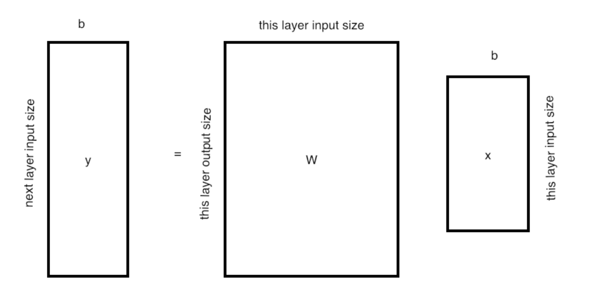

# 机器学习

**机器学习**（Machine Learning，ML）是一些处理 "智能 "问题的技术的统称，如图像识别。抽象地讲，这些问题是从一个**特征向量**（features）空间（如图像中的像素值）到另一个结果向量空间的映射。在图像识别字母的情况下，这个最终空间可能是26维的，第二个分量的最大值将表明一个 "B "被识别。

ML技术的基本特征是，这种映射是由大量的内部参数描述的，而且这些参数是逐步完善的。这里的学习方面是，通过将输入与基于当前参数的预测输出和预期输出进行比较来完善参数。

## 神经网络

现在最流行的ML形式是深度学习（DL），或**神经网络**（neural networks）。神经网络，或深度学习网络，是一个计算数字输出的函数，给定一个（通常是多维的）输入点。假设这个输出被归一化为区间[0, 1]，我们可以通过在输出上引入一个阈值来使用神经网络作为一个分类工具。

为什么是 "神经的"网络？

在生物体内，神经元是一个 "发射 "的细胞，也就是说，如果它收到某些输入，就会发出一个高电压。在ML中，我们把它抽象为一个感知器：一个根据某些输入而输出数值的函数。具体来说，输出值通常是输入的线性函数，其结果限制在（0，1）范围内。

### 单个数据点

在其最简单的形式中，我们有一个输入，其特征是一个特征向量$s\bar{x}$，和一个标量输出$y$。我们可以通过使用相同大小的权重向量和标量偏置𝑏来计算$y$作为$x$的线性函数。
$$
y = \bar{w}\bar{x}+b
$$

### 激活函数

为了有一定的尺度不变性，我们引入了一个被称为激活函数的函数$\sigma$，它映射了$\mathbb{R}\rightarrow (0，1)$，我们实际上计算了标量输出$y$为
$$
\mathbb{R} \ni y=\sigma\left(\bar{w}^{t} \bar{x}+b\right)
$$
一种常见的sigmoid函数为
$$
\sigma(z)=\frac{1}{1+e^{-z}}
$$
该函数有一个有趣的特性，即
$$
\sigma^{\prime}(x)=\sigma(x)(1-\sigma(x))
$$
所以计算函数值和导数并不比只计算函数值开销大多少。

对于向量值的输出，我们以点的方式应用sigmoid函数。

```c
// funcs.cpp
template <typename V>
void sigmoid_io(const V &m, V &a) {
  a.vals.assign(m.vals.begin(),m.vals.end()); 
  for (int i = 0; i < m.r * m.c; i++) {
    // a.vals[i]*=(a.vals[i]>0); // values will be 0 if negative, and equal to themselves
    if positive
      a.vals[i] = 1 / (1 + exp(-a.vals[i])); 
  }
}
```

其他激活函数有：$y=tanh(𝑥)$或'ReLU'（矫正线性单元）。
$$
f(x)=\max(0,x).
$$
在其他地方（如DL网络的最后一层），softmax函数可能更合适。

### 多维输出

由$\bar{w}$、$\bar{b}$定义的单层可以实现我们对神经网的所有要求，这一点很罕见。通常情况下，我们使用一个层的输出作为下一个层的输入。这意味着我们计算的不是一个标量$y$，而是一个多维向量$\bar{y}$。

现在我们对输出的每个分量都有权重和偏置，所以
$$
\mathbb{R}^{n} \ni \bar{y}=\sigma(W \bar{x}+\bar{b})
$$
其中$W$现在是一个矩阵。

有几点看法：

- 如上所述，输出向量通常比输入的分量少，所以矩阵不是正方形，特别是不能倒置。

- sigmoid函数使整个映射变得非线性。

- 神经网络通常有多个层次，每个层次都是以$x \rightarrow y$ 的形式进行的映射。

  以上。

### 卷积

上面关于应用权重的讨论将输入视为一组没有进一步结构的特征。然而，在图像识别等应用中，输入向量是一个图像，有一个结构需要被承认。对输入向量进行线性化后，如果输入向量中的像素在水平方向上很接近，但在垂直方向上则不接近。

因此，我们的动机是找到一个能反映这种位置性的权重矩阵。我们通过引入内核来做到这一点：一个小的 "stencil"被应用于图像的各个点。(见第4.2.4节关于PDEs背景下的stencil的讨论）这样的内核通常是一个小的正方形矩阵，应用它是通过取模版值和图像值的内积来完成的。(这是对信号处理中卷积一词的不精确使用）。

例如：https://aishack.in/tutorials/image-convolution-examples/。

## 深度学习网络

现在我们将介绍一个完整的神经网络。这种介绍遵循[105]。

使用一个具有$L\geqslant 1$层的网络，其中 $\ell = 1$层是输入层，$\ell = L$层是输出层。

对于$\ell = 1,...,L$，第$\ell$层计算
$$
\begin{aligned}
z^{(\ell)} &=W^{(\ell)} a^{(\ell)}+b^{(\ell)} \\
y^{(\ell)} &=\sigma\left(y^{(\ell)}\right)
\end{aligned}
$$
其中，$a^{(1)}$是输入，$z^{(L+1)}$是最终输出。我们将其简洁地写成
$$
y^{(L)}=N_{\left\{W^{(\ell)}\right\}_{\ell},\left\{b^{(\ell)}\right\}_{e} l l}\left(a^{(1)}\right)
$$
其中我们通常会省略网对$W^{(\ell)}$、$𝑏^{(\ell)}$集的依赖。

```c
// net.cpp
void Net::feedForward(const VectorBatch &input) { 
  this->layers.front().forward(input); // Forwarding the input
  
  for (unsigned i = 1; i < layers.size(); i++) { 
    this->layers.at(i).forward(this->layers.at(i - 1).activated_batch);
  }
}

// layer.cpp
void Layer::forward(const VectorBatch &prevVals) {
  VectorBatch output( prevVals.r, weights.c, 0 ); 
  prevVals.v2mp( weights, output );
  output.addh(biases); // Add the bias
  activated_batch = output; 
  apply_activation<VectorBatch>.at(activation)(output, activated_batch);
}
```

### 分类

在上述描述中，输入$x$和输出$y$都是向量值。也有一些情况是需要不同类型的输出的。例如，假设我们想描述数字的位图图像；在这种情况下，输出应该是一个整数0⋯9。

我们通过让输出$y$在$\mathbb{R}^{10}$中来解决这个问题，如果$y_5$比其他输出成分足够大，我们就说网络能识别数字5。通过这种方式，我们保持整个故事仍然是实值的。

### 误差最小化

通常我们有数据点${x_i}_{i=1,𝑁}，$有已知的输出$y_i$，我们想让网络预测尽可能好地再现这种映射。从形式上看，我们寻求最小化成本，或者说误差。
$$
C=\frac{1}{N} L\left(N\left(x_{i}\right), y_{i}\right)
$$
在所有选择${W}$，${b}$中。(通常我们不会明确说明这个成本是所有$W^{[\ell]}$权重矩阵和$b^{[\ell]}$偏差的函数。)

```c
float Net::calculateLoss(Dataset &testSplit) { 
  testSplit.stack(); feedForward(testSplit.dataBatch);
  const VectorBatch &result = output_mat();

  float loss = 0.0;
  for (int vec=0; vec<result.batch_size(); vec++) { // iterate over all items
    const auto& one_result = result.get_vector(vec);
    const auto& one_label = testSplit.labelBatch.get_vector(vec); assert(one_result.size()==one_label.size() );
    for (int i=0; i<one_result.size(); i++) // Calculate loss of result
      loss += lossFunction( one_label[i], one_result[i] ); 
  }
  loss = -loss / (float) result.batch_size(); return loss;
}
```

成本最小化意味着选择权重$\{W^{(\ell)}\}_\ell$和偏置$\{b^{(\ell)}\}_\ell$，使得对于每个$x$。
$$
\left[\left\{W^{(\ell)}\right\}_{\ell},\left\{b^{(\ell)}\right\}_{\ell}\right]=\underset{\{W\},\{b\}}{\operatorname{argmin}} L\left(N_{\{W\},\{b\}}(x), y\right)
$$
其中$L(N(x),y)$是一个损失函数，描述计算出的输出$N(x)$与预期输出$y$之间的距离。

我们使用梯度下降法找到这个最小值。
$$
w\leftarrow w+\Delta w
$$
其中
$$
\Delta W=\frac{\partial L}{\partial W_{i j}^{(\ell)}}
$$
这是一个复杂的表达式，我们现在将不做推导。

### 系数的计算

我们对成本相对于各种权重、偏差和计算量的部分导数感兴趣。对于这一点，引入一个简短的方法是很方便的。
$$
\delta_{i}^{[\ell]}=\frac{\partial C}{\partial z_{i}^{[\ell]}} \quad \text { for } 1 \leq i \leq n_{\ell} \text { and } 1 \leq \ell<L
$$
现在应用连锁法则（完整的推导见上面引用的论文），我们得到，用$x \circ y$表示点式（或哈达玛）向量-向量积$\{x_iy_i\}$。

- 在最后层
  $$
  \delta^{[L-1]}=\sigma^{\prime}\left(z^{[L-1]}\right) \cdot\left(a^{[L]}-y\right)
  $$

- 递归到前一层级
  $$
  \delta^{[\ell]}=\sigma^{\prime}\left(z^{[\ell]}\right) \circ\left(W^{[\ell+1]^{t}} \delta^{[\ell+1]}\right)
  $$

- 对偏置量的敏感性
  $$
  \frac{\partial C}{\partial b_{i}^{[\ell]}}=\delta_{i}^{[\ell]}
  $$

- 对权重的敏感性
  $$
  \frac{\partial C}{\partial w_{i k}^{[\ell]}}=\delta_{i}^{[\ell]} a_{k}^{[\ell-1]}
  $$

使用特殊形式
$$
\sigma(x)=\frac{1}{1+e^{-x}}
$$
给出
$$
\sigma^{\prime}(x)=\sigma(x)(1-\sigma(x))
$$


### 算法

现在我们在图12.1中介绍完整的算法。我们的网络有$\ell = 1, ... , L$，其中参数$n_\ell$表示层$\ell$的输入大小。

第1层有输入$x$，第$L$层有输出$y$。考虑到minibatch的使用，我们让$x$，$y$表示一组大小为$b$的输入/输出，因此它们的大小分别为$n_1\times b$和$n_{L+1}\times b$。

## 计算层面

在本节中，我们将讨论深度学习的高性能计算方面。在标量意义上，我们论证了矩阵-矩阵乘积的存在，它可以被高效率地执行。我们还将讨论并行性，重点是数据并行，其基本策略是分割数据集。

- 模型并行，其基本策略是分割模型参数；以及
- 流水线化，在这种情况下，指令可以按照比原始的模型更多的串行执行。

### 重量矩阵乘积

无论是在应用网，即前向传递，还是在学习，即后向传递中，我们都要对权重矩阵进行矩阵乘向量的乘积。这种操作没有太多的缓存重用，因此性能不高；1.7.11节。

另一方面，如果我们将一些数据点捆绑在一起--这有时被称为小批量--并对它们进行联合操作，我们的基本操作就变成了矩阵乘以矩阵乘积，它能够有更高的性能；1.6.1.2节。



我们在图12.2中描述了这一点。

- 输入批和输出批由相同数量的向量组成。

- 权重矩阵$W$的行数等于输出大小，列数等于输入大小。相当于输入规模。

gemm内核的这种重要性（1.6.1和6.4.1节）导致人们为其开发专用硬件。

另一种方法是使用权重矩阵的特殊形式。在[143]中，研究了用托普利茨矩阵的近似。这在节省空间方面有优势，而且可以通过FFT进行乘积。

### 权重矩阵乘积的并行性

我们现在可以考虑有效计算$N(x)$。前面已经说过，矩阵-矩阵多运算是一个重要的内核，但除此之外，我们还可以使用并行处理。图12.3给出了两种并行化策略。

在第一种策略中，批处理被划分到各个进程中（或者说，多个进程同时处理独立的批处理）；我们把这称为数据并行。

**练习 12.1** 考虑在共享内存环境下的这种情况。在这段代码中。

```c
for 𝑏 = 1, ... , batchsize
  for 𝑖 = 1,...,outsize 
    𝑦𝑖,𝑏 ← ∑𝑗 𝑊𝑖,𝑗 ⋅ 𝑥𝑗,𝑏
```

假设每个线程计算1，...的部分内容。, batchsize的范围。把这一点翻译成你最喜欢的编程语言。你是按行还是列来存储输入/输出向量？为什么？这两种选择的影响是什么？

**练习 12.2** 现在考虑分布式内存背景下的数据并行，每个进程都在批处理的一个片断（块列）上工作。你看到一个直接的问题了吗？

还有第二种策略，被称为模型并行，其中模型参数，也就是权重和偏差是分布式的。正如在图12.3中看到的，这立即意味着该层的输出向量是分布式计算的。

**练习 12.3** 概述一下分布式内存中第二个分区的算法。

这些策略的选择取决于模型是否很大，权重矩阵是否需要被分割，或者输入的数量是否很大。当然，也可以把这些结合起来，模型和批处理都是分布式的。

### 权重更新

权重更新的计算
$$
\Delta W^{(\ell)} \leftarrow \delta^{(\ell)} a^{(\ell-1)} t
$$
是一个等级为$b$的外积。它需要两个向量，并从它们中计算出一个低秩矩阵。

**练习 12.4** 根据$n_\ell$和$b$之间的关系，讨论该操作中（潜在）的数据重用量。为简单起见，假设$n_{\ell+1}\approx n_\ell$。

**练习 12.5** 讨论图 12.3 的两种分区策略中所涉及的数据移动结构。

除了这些方面，当我们考虑并行处理小批量时，这个操作变得更加有趣。在这种情况下，每个批次都独立地计算一个更新，我们需要对它们进行平均。在假设每个进程计算一个完整的$\Delta W$的情况下，这就变成了一个全还原。这种 "HPC技术 "的应用被开发成Horovod软件[76, 181, 111]。在一个例子中，在涉及40个GPU的配置上显示了相当大的速度。

另一个选择是延迟更新，或以异步方式执行。

**练习 12.6** 讨论在MPI中实现延迟或异步更新的问题。

### 流水线

最后一种类型的并行可以通过在各层上应用流水线来实现。简要说明这如何能提高训练阶段的效率。

### 卷积

应用卷积相当于乘以一个托普利茨矩阵。这比完全通用的矩阵-矩阵乘法的复杂度要低。

### 稀疏矩阵

权重矩阵可以通过忽略小条目而被稀疏化。这使得稀疏矩阵乘以密集矩阵的乘积成为主要的操作[72]。

### 硬件支持

从上述内容中，我们可以得出结论，gemm计算内核的重要性。将一个普通的CPU专门用于这一目的是对硅和电力的相当大的浪费。至少，使用GPU是一个节能的解决方案。

然而，通过使用特殊用途的硬件，甚至可以达到更高的效率。下面是一个概述：https://blog.inten.to/hardware-for-deep-learning-part-4-asic-96a542fe6a81 在某种程度上，这些特殊用途的处理器是收缩阵列的再世。

### 降低精度

见3.7.4.2节。

## Stuff

通用近似定理

设$\varphi(⋅)$是一个非常数、有界、单调增加的连续函数。让$𝐼𝑚$表示$𝑚$维的单位超立方体$[0,1]^m$。$𝐼𝑚$上的连续函数空间用$C（I_m）$表示。那么，给定任何函数$f\in C(I_m)$和$\varepsilon>0$，存在一个整数$N$，实常数$v_i,b_i\in \mathbb{R}$和实向量$w_i\in \mathbb{R}^m$，其中$i=1,⋯，N$，这样我们可以定义。
$$
F(x)=\sum_{i=1}^{N} v_{i} \varphi\left(w_{i}^{T} x+b_{i}\right)
$$
作为函数$f$的近似实现，其中$f$与$\varphi$无关；即。
$$
|F(x)-f(x)|<\varepsilon
$$
对于所有$x\in Im$。换句话说，$F(x)$形式的函数在$C(I_m)$中是密集的。

NN可以近似于乘法吗？

https://stats.stackexchange.com/questions/217703/can-deep-neural-network-approximate

传统的神经网络由线性图和Lipschitiz激活函数组成。作为Lischitz连续函数的组合，神经网络也是Lipschitz连续的，但乘法不是Lipschitz连续。这意味着，当$x$或$y$中的一个数字过大时，神经网络工作不能近似于乘法。